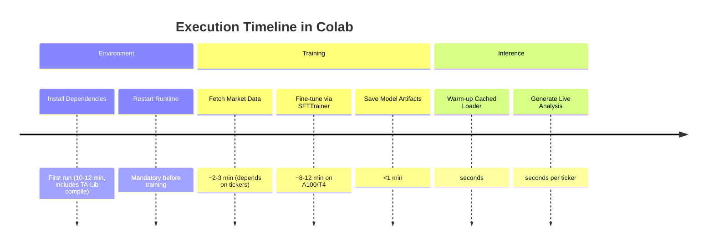

# FineTunedStockLLM

FineTunedStockLLM demonstrates how to collect high-volatility equity data, engineer trading-focused features, and fine-tune a quant-focused large language model using [Unsloth](https://github.com/unslothai/unsloth) on top of Meta's Llama 3.1 8B Instruct. The notebook-driven workflow is optimized for **Google Colab GPU runtimes** (Colab Pro/Pro+ or Colab Enterprise are strongly recommended for faster paid compute) and finishes with a lightweight inference helper that can score new tickers in near real time.

> ⚠️ **Financial disclaimer:** This project is for research and educational purposes only. It does **not** provide financial advice, guarantees of performance, or suitability for production trading decisions. Always perform your own due diligence and consult licensed professionals where appropriate.

---

## 📘 Table of Contents
1. [Visual Project Overview](#-visual-project-overview)
2. [Key Files](#-key-files)
3. [Why Google Colab + GPU?](#-why-google-colab--gpu)
4. [Step-by-Step Colab Execution Guide](#-step-by-step-colab-execution-guide)
5. [Notebook Walkthrough](#-notebook-walkthrough)
6. [Model Training Pipeline Details](#-model-training-pipeline-details)
7. [Running Live Inference](#-running-live-inference)
8. [Configuration & Customization](#-configuration--customization)
9. [Troubleshooting & Operational Tips](#-troubleshooting--operational-tips)
10. [Frequently Asked Questions](#-frequently-asked-questions)
11. [License](#-license)

---

## 🎯 Visual Project Overview

```mermaid
flowchart TD
    A[Yahoo Finance Price History] -->|Fetch & Clean| B[Feature Engineering]
    B -->|Build Prompts| C[Instruction Dataset]
    C -->|SFT Trainer (LoRA)| D[Fine-Tuned Llama 3.1 8B]
    D -->|Saved to trading_model/| E[GPU-Optimized Inference]
    E -->|Ticker Prompt| F[Live Trading Narrative]
```



---

## 🗂️ Key Files

| File | Description |
| --- | --- |
| `mode_stocker.ipynb` | End-to-end Colab notebook covering dependency setup, data processing, fine-tuning, and live inference helper functions. |
| `README.md` | This detailed guide describing goals, workflow, and execution steps. |
| `LICENSE` | Open-source license applied to the repository. |
| `trading_model/` *(created at runtime)* | Directory that stores the fine-tuned LLM weights and tokenizer once training completes. |

---

## ⚡ Why Google Colab + GPU?

* **Turn-key GPU access:** Unsloth's 4-bit quantized adapters still benefit greatly from NVIDIA GPUs (T4, L4, A100). Colab Pro/Pro+ subscribers gain priority access to faster paid accelerators that shrink training time dramatically.
* **Volatile installation steps:** The notebook compiles TA-Lib from source. Doing so in Colab's disposable environment avoids polluting local machines while also guaranteeing consistent glibc/libstdc++ versions.
* **Cost control:** You pay only for the runtime you consume. Training + testing typically finishes within a single Colab session, making Pro/Pro+ pricing viable for experimentation.
* **Zero local setup:** Browser-based notebooks allow analysts to iterate quickly without juggling CUDA, Python, or driver versions.

> 💡 **Tip:** When available, choose an A100 or L4 runtime under `Runtime ▸ Change runtime type ▸ Hardware accelerator`. Colab Pro/Pro+ members see these GPUs more frequently than free-tier users.

---

## 🧭 Step-by-Step Colab Execution Guide

1. **Open the notebook.**
   - Download/clone this repository and upload `mode_stocker.ipynb` to Google Drive, *or*
   - Use `File ▸ Open notebook ▸ GitHub` inside Colab and paste the repository URL.

2. **Enable a GPU runtime (paid tier recommended).**
   - In Colab, select `Runtime ▸ Change runtime type`.
   - Choose **GPU** as the hardware accelerator (A100 or L4 preferred for Colab Pro/Pro+).
   - Save the setting; Colab will reconnect to a GPU-backed instance.

3. **Confirm GPU availability and driver versions.** Run:
   ```python
   !nvidia-smi
   ```
   You should see NVIDIA driver info and the GPU type. If not, recheck the runtime configuration.

4. **Install all dependencies (Notebook Cell 0).**
   - Execute the first cell, which installs Unsloth, finance/data packages, and builds TA-Lib from source.
   - This step can take 10–12 minutes the first time because of the TA-Lib compilation.
   - **Do not interrupt** until you see `✅ Installation complete! Please RESTART RUNTIME now!`

5. **Restart the Colab runtime.**
   - Click `Runtime ▸ Restart runtime` (mandatory so the TA-Lib shared library loads correctly).
   - Re-run the imports/training cell afterwards.

6. **Run the training & evaluation cell (Notebook Cell 1).**
   - This cell imports libraries, fetches high-risk tickers from Yahoo Finance, engineers indicators, builds instruction-style prompts, and fine-tunes `unsloth/llama-3.1-8b-instruct-bnb-4bit` using LoRA adapters.
   - Training arguments are tuned for small-batch GPU usage (batch size 1 with gradient accumulation, 50 SFT steps). Expect ~8–12 minutes on paid GPUs.
   - After training, the notebook saves artifacts to the `trading_model/` directory and prints a sample generation for TSLA.

7. **Warm up the inference utilities (Notebook Cells 2 & 3).**
   - Cell 2 defines a cached loader (`load_trading_model`) and the `analyze_live_stock` helper that fetches fresh Yahoo Finance data and generates an analysis narrative.
   - Cell 3 shows example usage with two biotech tickers.

8. **Persist artifacts (optional).**
   - Download `trading_model/` via `Files ▸ Download` in Colab, or copy it to Google Drive for later sessions.

---

## 🧪 Notebook Walkthrough

| Cell | Purpose | Key Outputs |
| --- | --- | --- |
| 0 | Installs dependencies (Unsloth, TA-Lib, transformers stack, finance libs). | Shell log confirming installations and restart reminder. |
| 1 | Imports libraries, defines technical indicators, data processing, prompt formatting, and training routines (`SFTTrainer`). | Fine-tuned model + tokenizer saved to `trading_model/`, printed evaluation sample. |
| 2 | Adds cached model loader and live inference helper for real-time ticker analysis. | Functions ready for reuse (`load_trading_model`, `analyze_live_stock`). |
| 3 | Demonstrates inference on selected tickers. | Console output containing generated recommendations and rationales. |

---

## 🧱 Model Training Pipeline Details

1. **Ticker Universe.** Focused on high-beta, news-sensitive equities (e.g., TSLA, NVDA, AMC, MARA). Adjust `StockDataProcessor.high_risk_tickers` to customize the training universe.
2. **Data Acquisition.** Uses `yfinance` to download 1-year daily OHLCV bars for each ticker.
3. **Feature Engineering.** Custom `TechnicalIndicators` class computes RSI, MACD (with signal line), SMA overlays, daily returns, and volume statistics without requiring TA-Lib at inference time.
4. **Prompt Construction.** Each row becomes an instruction/response pair summarizing indicators, volatility, and a recommended stance (BUY/SELL/HOLD etc.) based on forward 1-day returns.
5. **Fine-Tuning.** `SFTTrainer` from `trl` performs supervised fine-tuning with LoRA adapters (`r=16`, gradient checkpointing) to keep GPU memory usage manageable.
6. **Saving Artifacts.** The fine-tuned adapter weights and tokenizer are written to `trading_model/` for reuse in later sessions.

---

## 📈 Running Live Inference

After training (or when `trading_model/` is uploaded from a previous session):

```python
# Warm up the cached loader
model, tokenizer, device = load_trading_model()

# Analyze one or more tickers
analyze_live_stock("TSLA")
analyze_live_stock("SCPH")
```

The loader automatically reuses the model across tickers, avoiding redundant disk I/O on subsequent calls. The helper also validates tickers, handles missing data, and prints a formatted narrative similar to:

```
📊 Live Analysis for TSLA:
==============================
RECOMMENDATION: HOLD
REASONING: TSLA shows neutral RSI with bullish MACD crossover and elevated volume (1.42x avg).
TARGET: +1.20% expected 1-day move.
RISK: HIGH - use small position size.
```

> ℹ️ **Inference hardware:** The cached loader prefers CUDA (`torch.cuda.is_available()`). If a GPU is unavailable, the helper will still run on CPU, but generation latency increases significantly.

---

## 🔧 Configuration & Customization

* **Change tickers or lookback:** Edit `StockDataProcessor.high_risk_tickers` and/or `fetch_stock_data(..., period='2y')` to widen the dataset.
* **Adjust sampling density:** Modify the `sample_size` logic in `prepare_training_data` to control how many rows feed the instruction dataset per ticker.
* **Alter training horizon:** Tweak the `Future_1d` target thresholds in `create_training_prompt` to reflect different return expectations (e.g., 5-day horizon).
* **Swap base model:** Update `setup_and_train_model()` to pull a different Unsloth-compatible checkpoint (ensure GPU memory headroom).
* **Use pre-trained weights:** Upload an existing `trading_model/` directory into Colab (via Drive or zipped archive) and skip the training cell.

---

## 🛟 Troubleshooting & Operational Tips

| Symptom | Cause | Resolution |
| --- | --- | --- |
| `ModuleNotFoundError: TA-Lib` | Runtime not restarted after install cell. | Use `Runtime ▸ Restart runtime`, then re-run Cell 1. |
| GPU out of memory during training | Using free-tier T4 with multiple notebooks open. | Close other sessions, lower `max_steps`, or upgrade to Colab Pro for higher-memory GPUs. |
| `❌ Trained model directory ... not found` | Inference cell run before training completed/saved. | Ensure Cell 1 finishes successfully; confirm `trading_model/` exists in the file browser. |
| Slow inference | Running on CPU because GPU unavailable. | Verify `!nvidia-smi`, ensure runtime type is GPU, or upgrade to a paid tier for more consistent accelerators. |
| Empty data for a ticker | Illiquid or delisted symbol in Yahoo Finance. | Choose an actively traded ticker or extend the history period. |

---

## ❓ Frequently Asked Questions

1. **Can I skip TA-Lib after training?** Yes. All inference-time indicators rely on the pure-Pandas utilities defined in the notebook; TA-Lib is needed only during the initial setup for additional experimentation.
2. **How long does training take?** ~10 minutes on an A100/L4, 20+ minutes on a T4. Paid tiers reduce queue times and allocate faster GPUs.
3. **Can I export the model to Hugging Face?** Absolutely—upload the `trading_model/` directory or adapt the save step to `push_to_hub` with appropriate tokens.
4. **Is CPU-only execution possible?** The code will run, but expect multi-minute generations and potential OOM errors during fine-tuning. GPU usage is strongly recommended.
5. **How do I resume training later?** Store `trading_model/` (plus optimizer states if you modify the training script) in Drive. Load it back into Colab and continue training from that checkpoint.

---

## 📝 License

This repository is released under the terms of the [MIT License](LICENSE). You are free to use, modify, and distribute the code, provided the license text accompanies any copies or derivative works.

---

**Happy experimenting, and remember to monitor your Colab usage to stay within the limits of your paid GPU plan!**
